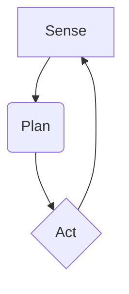

# Chapter 1: Introduction to Physical AI

Welcome to the world of Physical AI! This chapter marks the beginning of our journey into a fascinating and rapidly evolving field that bridges the gap between the digital realm of intelligence and the physical world we inhabit. Where digital AI processes data, Physical AI acts, perceives, and learns in a world full of real-world constraints and uncertainties.

## What You Will Learn

- [LO-01]: Define Physical AI and embodied intelligence.
- [LO-02]: Explain why physical constraints matter in AI systems.
- [LO-03]: Compare and contrast digital AI vs Physical AI systems.

## Before You Begin

No prior knowledge is required for this chapter. Let's dive in!

---

## Defining Physical AI

At its core, **Physical AI** is a field of artificial intelligence focused on systems that can perceive, reason about, and interact with the physical world. Unlike purely digital AI that exists only in computer memory (like a chess program or a language model), Physical AI gives bodies to intelligent agents. This concept is closely tied to **Embodied Intelligence**, which is the idea that an agent's body (its sensors, actuators, and physical form) is a crucial part of its intelligence. The body is not just a vessel for a computational brain; it actively shapes how the agent learns and experiences the world. This is a central tenet of **Embodied Cognition**.

Think of the difference between a chatbot and a robot vacuum. The chatbot's world is text. The robot vacuum's world is your living room, with all its obstacles, textures, and unpredictable events. The vacuum must use its sensors to understand this world and its motors to act within it. That is Physical AI in action.

## Digital AI vs. Physical AI

The differences between **Digital AI** and Physical AI are fundamental. Digital AI, whether it is **Symbolic AI** (using rules and logic) or **Connectionist AI** (using neural networks), operates on clean, abstract data. A picture is just a grid of pixels; a word is just a token in a vocabulary.

Physical AI, on the other hand, must deal with the messy reality of **Embodiment**. It is constrained by **Physical Constraints** like physics, energy, and time.

Here’s a comparison:

| Feature | Digital AI | Physical AI |
| :--- | :--- | :--- |
| **Environment** | Virtual, abstract, rule-based | Real-world, dynamic, uncertain |
| **Data** | Clean, structured, complete | Noisy, unstructured, incomplete |
| **Action** | Algorithmic manipulation, data output | Physical movement, interaction |
| **Key Challenge** | Computation, logic, pattern recognition | Real-time response, uncertainty, safety |

A Digital AI playing a simulated driving game has perfect information about the car's state. A Physical AI driving a real car must contend with sensor noise, slippery roads, and the unpredictable actions of other drivers.

## The Sense-Plan-Act Loop

A foundational concept in robotics and Physical AI is the **Sense-Plan-Act** loop. It’s a simple yet powerful model for how an embodied agent operates.

1.  **Sense**: The agent uses its **Sensors** (like cameras, LiDAR, or touch sensors) to gather information about its internal state and the external environment.
2.  **Plan**: The agent's "brain" processes this sensory data to make a decision. This **Planning** phase involves reasoning about the world, predicting outcomes, and deciding on a course of action to achieve a goal.
3.  **Act**: The agent uses its **Actuators** (motors, grippers, wheels) to execute the chosen action. This action changes the agent's state and/or the state of the environment, leading to a new set of sensory inputs, and the loop begins again.

This continuous loop is the essence of how a robot interacts with its environment to perform tasks.

## Physical Constraints and Systems Thinking

Designing a Physical AI system requires thinking about the entire system, not just the algorithm. The real world is full of limitations that don't exist in a purely digital space.

-   **Noise**: Sensors are never perfect. A camera image might be blurry, or a LiDAR reading might be inaccurate. The AI must be robust enough to handle this imperfect information.
-   **Latency**: It takes time for an agent to sense, plan, and act. In a fast-moving environment, this delay can be the difference between success and failure. A self-driving car can't afford to have a multi-second delay in its braking system.
-   **Uncertainty**: The world is not always predictable. Objects can move, surfaces can be slippery, and the agent's own actions might not have the intended effect. The AI must be able to operate under this uncertainty.
-   **System Integration**: In a robot, the software, electronics, and mechanical components are all deeply intertwined. A change in one part can have cascading effects on the others. This requires a holistic, **System Integration** approach to design and problem-solving.

---

## Connecting to the Physical World

This chapter has introduced the core ideas that separate Physical AI from its digital counterpart. The concepts of sensor noise, actuation delays, and environmental uncertainty are not just theoretical; they are the everyday challenges that robotics engineers work to overcome.

-   **[PWC-01] Sensor noise and its implications**: The data a robot receives is never a perfect representation of the world. This is why techniques like filtering and sensor fusion (which we will cover later) are critical for building a reliable understanding of the environment.
-   **[PWC-02] Actuation delays and their effects on control**: When a robot decides to move, the command takes time to travel to the motors, and the motors take time to respond. Control algorithms must account for these delays to avoid instability and overshoot.
-   **[PWC-03] Environmental uncertainty and its challenge to planning**: A robot's plan might become invalid as soon as it's made because the world has changed. This is why robots often need to re-plan continuously, adapting to new information as it becomes available.

## Exercises

1.  **[EX-01] Conceptual Definitions**:
    - Define **Physical AI**, **Embodied Intelligence**, and **Embodied Cognition** in your own words.
    - *Assessment Criteria*: Your definitions should be accurate and demonstrate a clear understanding of the distinction between intelligence in a digital vs. a physical context.

2.  **[EX-02] Comparative Analysis**:
    - Consider the task of translating a sentence from English to French. Compare how a purely digital AI (like a web-based translation service) accomplishes this versus a hypothetical Physical AI (like a robot that signs the translation). What are the key differences in their challenges?
    - *Assessment Criteria*: Your analysis should identify key differences in input, output, and the constraints each system faces. It should highlight the role of embodiment for the physical system.

3.  **[EX-03] Problem Identification**:
    - Imagine a robot designed to deliver coffee in an office. Identify at least three potential physical constraints it might face and explain their impact on the robot's design and operation.
    - *Assessment Criteria*: Your answer should correctly identify relevant physical constraints (e.g., navigating people, spilling hot liquid, battery life) and explain their implications.

---

## Conclusion

In this chapter, you have taken your first step into the exciting world of Physical AI. You've learned what it means for an AI to be "embodied," how it differs from digital AI, and the fundamental Sense-Plan-Act cycle that governs its operation. Most importantly, you've started to appreciate the critical role that real-world physical constraints play in the design of intelligent robotic systems.

In the next chapter, we will get more concrete by exploring the physical anatomy of robots, including their joints, links, and the mathematical language we use to describe their motion.