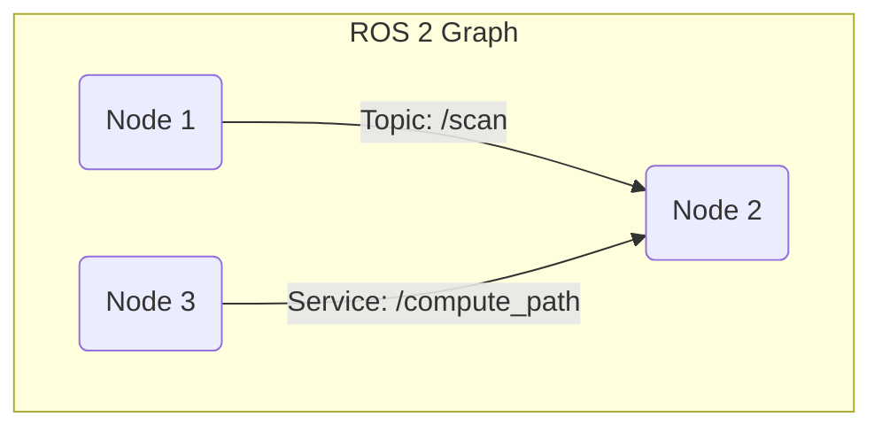

# Chapter 3: ROS 2 Fundamentals

With a grasp of a robot's physical and mathematical structure, we now turn to the software that brings it all together. A modern robot is a complex, distributed system with many processes running at once—for sensing, planning, and acting. How do all these pieces talk to each other? The answer is middleware, and the de facto standard in robotics is the Robot Operating System (ROS). In this chapter, you'll learn the fundamentals of ROS 2.

## What You Will Learn

- [LO-01]: Understand the fundamental architecture and components of ROS 2.
- [LO-02]: Effectively use ROS 2 nodes, topics, and services for inter-process communication.
- [LO-03]: Explain the necessity and benefits of robotics middleware like ROS 2.
- [LO-04]: Create, compile, and run basic ROS 2 packages and executables.

## Before You Begin

You should be comfortable with Python basics. We will be using Python to write our ROS 2 programs.

---

## Why Middleware?

Imagine building a robot from scratch. You'd have one program for reading sensor data, another for motor control, and a third for high-level planning. You would have to invent your own way for them to communicate, manage their timing, and handle errors. This is difficult and time-consuming.

**Middleware** is a software layer that solves this problem. It provides a standardized way for different software components to discover each other and exchange data, enabling **modularity**, **reusability**, and the creation of **distributed systems**. **ROS 2** is the leading open-source middleware for robotics.

## Introduction to ROS 2

ROS 2 is a complete rewrite of the original ROS, designed for modern robotics applications, including multi-robot systems and commercial products. It offers improved performance, security, and reliability over its predecessor.

## ROS 2 Architecture

The structure of a ROS 2 system is often called the **ROS 2 Graph**. It's a network of processes and the communication channels between them.



-   **Nodes**: A **Node** is the fundamental computational unit in ROS 2. Each node is a process responsible for a single task, like controlling a wheel, processing camera images, or planning a path.
-   **Client Libraries**: These are the libraries that allow you to write nodes in different programming languages. We will use **rclpy** for Python. The C++ equivalent is **rclcpp**.
-   **DDS (Data Distribution Service)**: This is the underlying communication technology that ROS 2 uses. It's an industry standard for real-time and reliable data exchange, which is a major reason for ROS 2's improved performance.

## ROS 2 Communication Patterns

Nodes communicate using three primary patterns: Topics, Services, and Actions.

### Topics

**Topics** use a **publish/subscribe** communication pattern. It's an anonymous, one-to-many communication method.
- A node *publishes* messages on a specific topic (e.g., `/camera/image`).
- Other nodes can *subscribe* to that topic to receive the messages.
- The publisher doesn't know or care who is subscribed.

**Message Types**: Each topic has a defined **message type**, like `String`, `Int64`, or more complex types like `sensor_msgs/Image`. This ensures that all nodes are speaking the same language on a given topic.

**Quality of Service (QoS)**: ROS 2 allows for fine-grained control over the **Quality of Service**. You can specify settings for reliability (e.g., "must receive every message" or "it's okay to drop some"), durability, and history depth.

### Services

**Services** use a **request/reply** communication pattern. It's a two-way, one-to-one communication method.
- A *client* node sends a single request to a *service* node.
- The service node processes the request and sends back a single reply.
- This is useful for tasks that have a clear beginning and end, like "compute the inverse kinematics for this pose."

### Actions

**Actions** are for long-running, goal-oriented tasks. They are similar to services but provide feedback during execution and are cancelable.
- An *action client* sends a goal to an *action server* (e.g., "navigate to the kitchen").
- The action server executes the goal, providing periodic *feedback* along the way (e.g., "distance to kitchen: 5 meters").
- Once complete, the server sends a final *result*. The client can cancel the goal at any time.

---

## Hands-On: Setting up a ROS 2 Workspace

A ROS 2 workspace is a directory where you store, build, and install your ROS 2 packages.

1.  **Create a directory**:
    ```bash
    mkdir -p ros2_ws/src
    cd ros2_ws
    ```
2.  **Build the workspace**:
    Even an empty workspace can be "built". This sets up the necessary file structure. We use the `colcon` build tool.
    ```bash
    colcon build
    ```
    After the build, you will see `build`, `install`, and `log` directories.

3.  **Source the workspace**:
    To use the packages installed in this workspace, you need to source its setup file.
    ```bash
    source install/setup.bash
    ```
    You must do this in every new terminal you open.

## Hands-On: Creating Basic ROS 2 Nodes

Let's create a simple Python package with a publisher and subscriber.

1.  **Create a package**:
    Navigate to your `ros2_ws/src` directory and run:
    ```bash
    ros2 pkg create --build-type ament_python my_python_pkg
    ```
2.  **Create a Publisher Node (`minimal_publisher.py`)**:
    Inside `my_python_pkg/my_python_pkg`, create a file named `minimal_publisher.py`:
    ```python
    import rclpy
    from rclpy.node import Node
    from std_msgs.msg import String

    class MinimalPublisher(Node):
        def __init__(self):
            super().__init__('minimal_publisher')
            self.publisher_ = self.create_publisher(String, 'topic', 10)
            timer_period = 0.5  # seconds
            self.timer = self.create_timer(timer_period, self.timer_callback)
            self.i = 0

        def timer_callback(self):
            msg = String()
            msg.data = f'Hello World: {self.i}'
            self.publisher_.publish(msg)
            self.get_logger().info(f'Publishing: "{msg.data}"')
            self.i += 1

    def main(args=None):
        rclpy.init(args=args)
        minimal_publisher = MinimalPublisher()
        rclpy.spin(minimal_publisher)
        minimal_publisher.destroy_node()
        rclpy.shutdown()

    if __name__ == '__main__':
        main()
    ```
3.  **Create a Subscriber Node (`minimal_subscriber.py`)**:
    In the same directory, create `minimal_subscriber.py`:
    ```python
    import rclpy
    from rclpy.node import Node
    from std_msgs.msg import String

    class MinimalSubscriber(Node):
        def __init__(self):
            super().__init__('minimal_subscriber')
            self.subscription = self.create_subscription(
                String,
                'topic',
                self.listener_callback,
                10)
            self.subscription  # prevent unused variable warning

        def listener_callback(self, msg):
            self.get_logger().info(f'I heard: "{msg.data}"')

    def main(args=None):
        rclpy.init(args=args)
        minimal_subscriber = MinimalSubscriber()
        rclpy.spin(minimal_subscriber)
        minimal_subscriber.destroy_node()
        rclpy.shutdown()

    if __name__ == '__main__':
        main()
    ```

4.  **Add Entry Points**:
    Open `setup.py` and add the `console_scripts` entry points so ROS 2 can find your nodes:
    ```python
    'console_scripts': [
        'talker = my_python_pkg.minimal_publisher:main',
        'listener = my_python_pkg.minimal_subscriber:main',
    ],
    ```
5.  **Build and Run**:
    -   Go to the root of your workspace (`ros2_ws`) and build: `colcon build`
    -   Source the workspace: `source install/setup.bash`
    -   In one terminal, run the talker: `ros2 run my_python_pkg talker`
    -   In a second terminal, run the listener: `ros2 run my_python_pkg listener`

You should see the listener printing the messages published by the talker!

---
## Connecting to the Physical World

-   **[PWC-01] Reliability of communication**: In a real robot, wireless links can be unreliable. ROS 2's QoS settings, built on DDS, allow you to configure topics for "best-effort" (fast but lossy) or "reliable" (guaranteed delivery) communication, which is critical for important commands.
-   **[PWC-02] Synchronization of data**: A robot's perception system might involve multiple cameras and a LiDAR, all producing data at different rates. ROS 2 messages are timestamped, which is the first crucial step in being able to synchronize and correlate data from different sources to get a coherent view of the world at a specific moment in time.

---

## Tools Spotlight

-   **ROS 2**: We are using ROS 2 because it is the industry-standard middleware for robotics. It provides a robust, flexible framework that saves developers from reinventing the wheel for basic communication, allowing them to focus on building high-level capabilities.
-   **Python**: We are using Python for its simplicity and ease of use, which makes it ideal for rapid prototyping and learning ROS 2 concepts.

---

## Exercises

1.  **[EX-01] Build a Simple Communication System**:
    - Create a new ROS 2 package.
    - Write a publisher node that publishes a `std_msgs/msg/String` message with the content "My name is [Your Name]" every 2 seconds. Include a timestamp in the log message.
    - Write a subscriber node that listens to the topic and prints the received message to the console.
    - *Assessment Criteria*: Correct creation of the package, nodes, and successful communication between them, verified by console output.

2.  **[EX-02] Modify a Service**:
    - Using the official ROS 2 documentation as a guide, find the `example_interfaces` package and the `AddTwoInts` service definition.
    - Create a new service definition in your own package called `MultiplyTwoInts` that takes two integers (`a` and `b`) and returns their product (`product`).
    - Write a service node and a client node to use your new service.
    - *Assessment Criteria*: Correct creation of the `.srv` file, and a client/server pair that correctly calculates and returns the product of two numbers.

3.  **[EX-03] Conceptual Questions**:
    - When would you use a ROS 2 Topic instead of a Service? Give an example for each.
    - *Assessment Criteria*: Your explanation should clearly articulate the one-to-many vs. one-to-one and the asynchronous vs. synchronous nature of Topics and Services, respectively, with appropriate examples.

---

## Conclusion

You have now learned the core concepts of ROS 2, the software backbone of modern robotics. You understand how to create nodes and use the publish/subscribe (Topics) and request/reply (Services) patterns to enable communication between different parts of a robot's software system. You've also set up your own workspace and run your own ROS 2 code.

In the next chapter, we will use these new software skills to explore the world of robotics simulation, a critical tool for safely developing and testing robot behaviors.