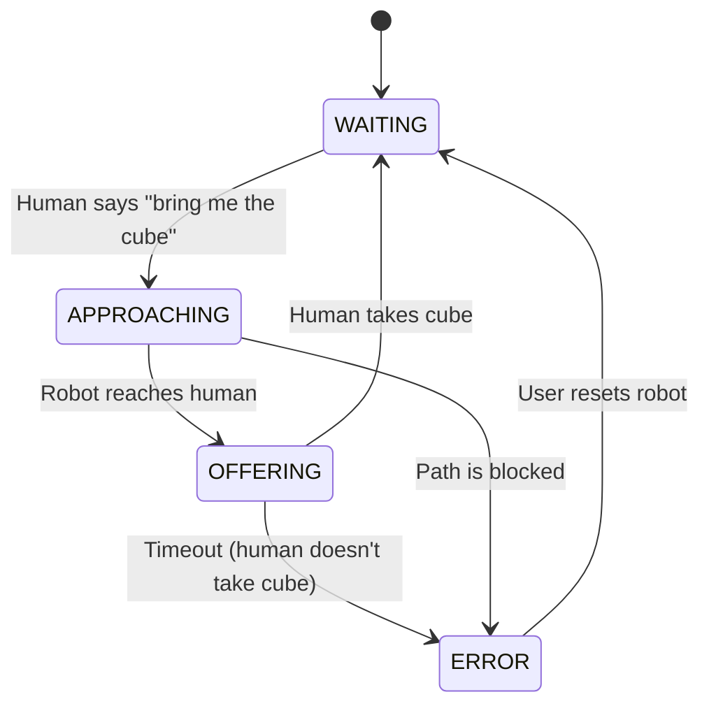

# Chapter 9: Safety, Ethics, & Human-Robot Interaction

Building a robot that works is only half the battle. Building a robot that works safely, behaves ethically, and interacts effectively with people is the true challenge. As robots move from factory floors to our homes, offices, and public spaces, these non-technical considerations become paramount. This chapter provides a framework for developing responsible and human-centric robotic systems.

## What You Will Learn

- [LO-01]: Identify and categorize potential safety hazards in a robotic application.
- [LO-02]: Apply a standard risk assessment methodology to a robotic system.
- [LO-03]: Analyze a robotic application for ethical issues related to privacy, bias, and job displacement.
- [LO-04]: Describe key principles of human-robot interaction, such as predictability, legibility, and social cues.
- [LO-05]: Design a basic HRI protocol for a collaborative task between a human and a robot.

## Before You Begin

You should have a general understanding of what robots are and how they perceive and act in the world from the previous chapters.

---

## Robot Safety and Risk Assessment

When a robot can exert physical force, **physical safety** becomes the most important design constraint. The field of robot safety provides standards and methodologies to ensure robots do not cause harm.

-   **Robot Safety Standards**: For industrial robots, standards like **ISO 10218** define requirements for safe robot design and integration. A key development from these standards is the concept of **collaborative robotics**, where robots are designed to work safely alongside humans without physical barriers. This is often achieved through:
    -   **Safety-Rated Monitored Stop**: The robot ceases all motion if a human enters its workspace.
    -   **Power and Force Limiting**: The robot's joints are designed so that they cannot exert a force or torque above a safe threshold, preventing crushing or impact injuries.

-   **Risk Assessment**: The core process of ensuring safety is **risk assessment**. A common methodology (based on standards like **ISO 12100**) involves these steps:
    1.  **Hazard Identification**: Systematically identify everything that could potentially cause harm.
    2.  **Risk Estimation**: For each hazard, estimate the severity of the potential harm and the probability of it occurring.
    3.  **Risk Evaluation**: Decide if the estimated risk is acceptable.
    4.  **Risk Reduction**: If the risk is unacceptable, implement mitigation strategies to reduce it. This could involve design changes, adding guards, or providing warnings.

## Ethical Frameworks for AI and Robotics

Beyond physical safety, we must consider the ethical implications of a robot's actions. How should a robot behave, and whose values should it reflect?

-   **Ethical Theories**:
    -   **Utilitarianism**: This framework suggests that the most ethical action is the one that produces the greatest good for the greatest number of people. For a self-driving car, this might mean choosing an action that minimizes the total number of injuries in an unavoidable accident.
    -   **Deontology**: This framework emphasizes moral duties and rules. It would argue that certain actions (like sacrificing a pedestrian) are inherently wrong, regardless of the outcome.
-   **Key Ethical Issues in Robotics**:
    -   **Algorithmic Bias**: If an AI is trained on biased data, it will produce biased outcomes. For example, a facial recognition system that is less accurate for certain demographic groups could lead to unfair or discriminatory robot behavior.
    -   **Accountability**: If an autonomous robot causes harm, who is responsible? The owner? The manufacturer? The programmer? Establishing clear lines of **accountability** is a major legal and ethical challenge.
    -   **Transparency**: We should be able to understand why a robot made a particular decision. This principle of **transparency** (or "explainability") is crucial for building trust and diagnosing failures.
    -   **Value Alignment**: How do we ensure that a robot's goals are aligned with human values? This is the **value alignment** problem, a long-term research challenge in AI safety.
    -   **Job Displacement**: As robots become more capable, they will inevitably automate tasks currently performed by humans, raising significant social and economic questions.

## Fundamentals of Human-Robot Interaction (HRI)

**Human-Robot Interaction (HRI)** is the scientific field dedicated to understanding, designing, and evaluating robotic systems for use by or with humans. The goal is to make interactions effective, safe, and pleasant.

-   **Legibility and Predictability**:
    -   **Legibility**: A robot's actions should be *legible*—a human should be able to look at the robot and easily understand what it is trying to do. For example, a robot about to move might flash a light in its intended direction of travel.
    -   **Predictability**: A robot's behavior should be consistent and predictable, allowing humans to form an accurate mental model of how it will act in a given situation.
-   **Proxemics**: This is the study of how people use space. A robot should respect social norms regarding personal space, approaching people at an appropriate speed and distance to avoid making them feel uncomfortable.
-   **Anthropomorphism**: This is our tendency to attribute human-like qualities to non-human agents. While a certain amount of **anthropomorphism** can make a robot more relatable (e.g., giving it "eyes"), designers must be careful not to create misleading expectations about the robot's capabilities or intelligence (as discussed in the "uncanny valley").
-   **Social Robotics**: This subfield focuses on creating robots designed for social roles, such as companions, tutors, or guides. These robots rely heavily on HRI principles to communicate effectively using social cues like gaze, gestures, and tone of voice.

---

## Tools Spotlight

-   **Risk Assessment Matrix**: This is a simple table used to visually categorize risks. One axis represents the severity of harm (from negligible to catastrophic), and the other represents the probability of occurrence (from improbable to frequent). This helps teams prioritize which hazards to address first.
-   **State Machine Diagrams**: As we will see in the hands-on section, a **state machine** is a powerful tool for designing predictable robot behavior. By explicitly defining the robot's states (e.g., `WAITING_FOR_COMMAND`, `MOVING_TO_USER`) and the transitions between them, we can create systems that are easier to understand, debug, and verify, which is crucial for safe HRI.

---

## Hands-On: Designing for Safety and Interaction

### [PRAC-01] Safety Risk Assessment

This is an analytical exercise. Consider a simulated UR5e robot arm whose task is to pick up a small cube and place it in a box.

1.  **Identify Hazards**: What could go wrong?
    -   Collision: The robot arm could hit a person.
    -   Crushing: A person's hand could get caught between the gripper and the box.
    -   Dropped Object: The robot could drop the cube.
2.  **Estimate Risk**: Use a simple 3x3 Risk Assessment Matrix (Low, Medium, High for both Severity and Probability). A collision might be High Severity but Low Probability (if people are trained to stay clear). Dropping the cube is Low Severity but might be Medium Probability.
3.  **Propose Mitigations**:
    -   For Collision: Implement a "safety-rated monitored stop" using a simulated depth camera to detect human presence.
    -   For Crushing: Use a gripper with power and force limiting.
    -   For Dropped Object: Improve the grasp planning algorithm.

### [PRAC-02] Designing an HRI State Machine

Let's design the logic for a robot handing an object to a person. We can use a state machine diagram for this.

This diagram clearly defines the robot's behavior. It will wait until commanded, then approach. Once it reaches the human, it enters the `OFFERING` state. It only returns to `WAITING` after the human has taken the object. This is a simple but robust way to design a predictable interaction.

---

## Connecting to the Physical World

-   **[PWC-01] Unpredictable Human Behavior**: A person might walk in front of the robot unexpectedly, or hesitate when taking an object. A well-designed HRI system doesn't assume the human will be perfectly predictable. It uses sensors to monitor the human and has fallback states and error-handling routines to manage these situations safely.
-   **[PWC-02] Physical Safety**: The concepts in this chapter—risk assessment, power and force limiting, safe stopping—are all about managing the physical reality that a robot's software has control over a powerful physical machine that can cause real harm if not properly constrained.

---

## Exercises

1.  **[EX-01] Ethical Case Study Analysis**:
    -   An autonomous drone is used by law enforcement to monitor a public park for illegal activity. Analyze this application from an ethical standpoint. What are the benefits? What are the potential harms or ethical violations (consider privacy, bias, and potential for error)?
    -   *Assessment Criteria*: Your analysis should identify the key ethical trade-offs and apply concepts like privacy and algorithmic bias to the specific case.

2.  **[EX-02] Improving an HRI Design**:
    -   Watch a video of a robot in a collaborative task (e.g., a cooking robot). Imagine you are the HRI designer. Identify one aspect of the robot's behavior that is not "legible" or "predictable." Propose a specific change (e.g., adding a light, a sound, or changing its movement) to improve the interaction.
    -   *Assessment Criteria*: Your critique should correctly identify a flaw based on HRI principles, and your proposed improvement should be concrete and well-justified.

---

## Conclusion

In this chapter, you have moved beyond the purely technical aspects of robotics to consider the equally important domains of safety, ethics, and human-robot interaction. You have learned how to think systematically about risk, how to apply ethical frameworks to robot behavior, and how to design interactions that are safe, effective, and legible. These skills are not optional; they are essential for any engineer hoping to build robots that will one day be a part of our daily lives.

In our final chapter, we will look at capstone projects that bring together all the concepts from this book—from kinematics and perception to learning and safe interaction—to build complete, end-to-end robotic systems.