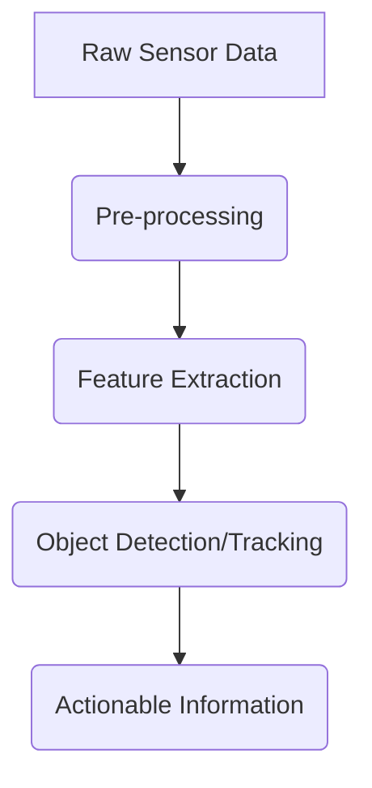

# Chapter 5: Robot Perception Systems

A robot is only as good as its ability to perceive the world. To act intelligently, a robot must first understand its environment. This is the domain of robot perception. In this chapter, you will learn how robots "see" and make sense of the world using a variety of sensors and processing techniques.

## What You Will Learn

- [LO-01]: Understand the principles and types of common robot sensors (cameras, LiDAR, IMU).
- [LO-02]: Describe the components of a typical robot perception pipeline.
- [LO-03]: Explain the concept of sensor fusion and its benefits.
- [LO-04]: Visualize and interpret data from different sensor modalities.

## Before You Begin

A basic understanding of linear algebra will be helpful for this chapter.

---

## Introduction to Robot Sensors

Robots use a wide array of sensors to gather information. Each has its own strengths and weaknesses.

-   **Cameras**: The eyes of the robot.
    -   **Monocular**: A single camera, provides 2D images. Great for color and texture, but poor at judging distance.
    -   **Stereo**: Two cameras side-by-side, which allows for depth perception, similar to human vision.
    -   **Depth**: A camera that directly measures the distance to each pixel, often using infrared light.
-   **LiDAR (Light Detection and Ranging)**: LiDAR sensors work by sending out pulses of laser light and measuring the time it takes for them to bounce back. This creates a "point cloud," which is a precise 3D map of the environment.
    -   **2D LiDAR**: Scans in a single plane, common for indoor navigation.
    -   **3D LiDAR**: Scans in multiple planes, providing a full 3D view, common for self-driving cars.
-   **IMU (Inertial Measurement Unit)**: An IMU measures the robot's own motion. It contains:
    -   **Accelerometers**: Measure linear acceleration.
    -   **Gyroscopes**: Measure rotational velocity.
-   **Encoders**: These sensors measure the rotation of a robot's joints or wheels, allowing the robot to know its own configuration (proprioception).
-   **Force/Torque Sensors**: Measure the forces and torques applied to a robot's joints or end-effector, which is crucial for tasks involving physical contact.

## Perception Pipelines

Raw sensor data is just a stream of numbers. A **perception pipeline** is a sequence of steps that transforms this raw data into actionable information.



1.  **Pre-processing**: The first step is to clean up the data. This involves **filtering** to reduce **sensor noise** or correcting for known sensor distortions.
2.  **Feature Extraction**: The pipeline then identifies interesting parts of the data, or **features**. For an image, this could be **edges**, **corners**, or **keypoints**. For a LiDAR scan, it could be planes or clusters of points.
3.  **Object Detection and Tracking**: Using the extracted features, the system detects and classifies objects of interest (e.g., "this cluster of points is a car"). It can then track these objects over time to understand their motion.
4.  **Actionable Information**: The final output is a high-level understanding of the world that the robot's planning module can use, such as "there is a person 2 meters in front of you."

## Sensor Fusion

Why use only one sensor when you can use many? **Sensor Fusion** is the process of combining data from multiple sensors to get a more accurate and robust understanding of the environment than any single sensor could provide alone.

-   **Why fuse data?**
    -   **Redundancy**: If one sensor fails, another can take over.
    -   **Complementarity**: Different sensors are good at different things. A camera provides rich color information, while a LiDAR provides accurate distance measurements. Fusing them gives you the best of both worlds.
    -   **Robustness**: Combining measurements can help to average out sensor noise and reduce uncertainty.
-   **Basic Techniques**: A common conceptual approach is the **Kalman Filter**, which is a mathematical tool for estimating the state of a system (e.g., the position of a car) by combining a series of noisy measurements over time.
-   **Challenges**:
    -   **Timing Synchronization**: Data from different sensors will arrive at different times. They must be correctly timestamped to be fused properly.
    -   **Data Association**: How do you know that a camera detection and a LiDAR detection correspond to the same physical object? This is the data association problem.

---

## Tools Spotlight

-   **OpenCV (Open Source Computer Vision Library)**: For our image processing tasks, we will use OpenCV. It is the world's largest computer vision library and provides thousands of optimized algorithms for all kinds of perception tasks.
-   **Python Visualization Libraries**: We will use standard Python libraries like `Matplotlib` to easily plot and visualize sensor data from pre-recorded files.

---

## Hands-On: Sensor Data Visualization and Processing

*(Note: These examples use pre-recorded data files to ensure reproducibility. See `reproducibility.md` for setup and data download instructions.)*

1.  **[PRAC-01] Sensor Data Visualization**:
    -   **Camera**: Use `matplotlib.pyplot.imshow` to load and display a sample `.jpg` image from our dataset.
    -   **LiDAR**: Use `matplotlib.pyplot.scatter` to plot the (x, y) coordinates from a sample 2D LiDAR scan file, showing the outline of a room.
    -   **IMU**: Use `matplotlib.pyplot.plot` to graph the gyroscope data from a sample IMU log file, showing how the robot's angular velocity changes over time.

2.  **[PRAC-02] Basic Image Processing with OpenCV**:
    Let's perform a simple edge detection task.
    ```python
    import cv2

    # Load a pre-recorded image
    image = cv2.imread('sample_image.jpg')

    # Convert to grayscale
    gray_image = cv2.cvtColor(image, cv2.COLOR_BGR2GRAY)

    # Apply a Gaussian blur to reduce noise
    blurred_image = cv2.GaussianBlur(gray_image, (5, 5), 0)

    # Detect edges using the Canny edge detector
    edges = cv2.Canny(blurred_image, 50, 150)

    # Display the original image and the edges
    cv2.imshow('Original', image)
    cv2.imshow('Edges', edges)
    cv2.waitKey(0)
    cv2.destroyAllWindows()
    ```
    This script demonstrates a simple, three-step perception pipeline: pre-processing (blur), feature extraction (edges), and visualization.

---

## Connecting to the Physical World

-   **[PWC-01] Sensor Noise**: As you saw in our OpenCV example, a key first step in any perception pipeline is often to filter the image to reduce noise. Real-world sensor data is always imperfect, and robust perception algorithms must be designed to handle this.
-   **[PWC-02] Sensor Limitations**: A camera has a limited **field of view**, a LiDAR has a maximum **range**, and an IMU has a maximum **update rate**. A robot's design must account for these limitations. For example, a self-driving car might use multiple cameras and LiDARs to achieve a 360-degree view of its surroundings.
-   **[PWC-03] Environmental Variability**: Perception is hard because the world is always changing. **Lighting conditions** affect cameras, reflective surfaces can fool LiDAR, and **dynamic scenes** (with moving cars and people) make object tracking a major challenge.

---

## Exercises

1.  **[EX-01] Sensor Identification**:
    - You are designing a robot to inspect pipes from the inside. The pipes are dark and narrow. What one or two sensors would be most critical for this task, and why?
    - *Assessment Criteria*: Your answer should demonstrate logical reasoning in selecting sensors appropriate for the environmental constraints.

2.  **[EX-02] Simple Perception Pipeline Design**:
    - Outline the steps of a perception pipeline for a robot whose only goal is to follow a red line painted on the floor, using a camera.
    - *Assessment Criteria*: Your answer should include a correct sequence of plausible steps (e.g., get image -> filter by color -> find the line's center -> output line's position).

3.  **[EX-03] Sensor Data Filtering**:
    - You are given a text file containing a single column of noisy sensor data. Implement a simple moving average filter in Python. The filter should, for each point, calculate the average of the previous `N` points.
    - *Assessment Criteria*: Correct implementation of the moving average algorithm in Python and a demonstration of how it reduces noise on the provided data.

---

## Conclusion

You have now learned the fundamentals of how robots perceive their environment. You know about the most common types of sensors, the stages of a perception pipeline that turn raw data into understanding, and the importance of sensor fusion. You've also gotten your hands dirty visualizing sensor data and using OpenCV to perform a basic computer vision task.

In the next chapter, we will explore how robots use this perceptual understanding to learn and make decisions, as we dive into the world of learning-based control.